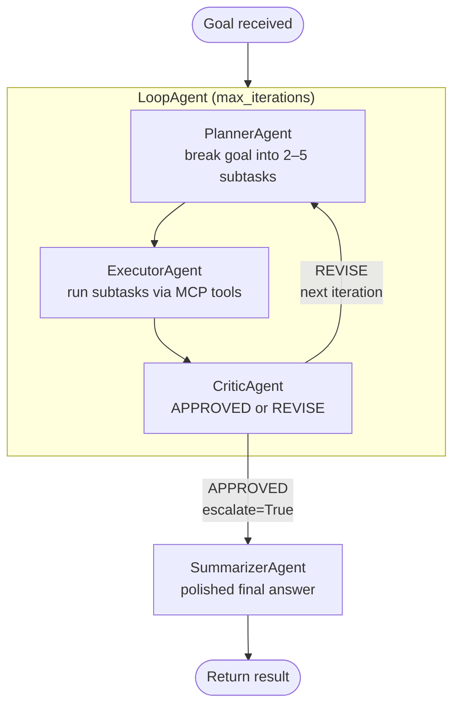
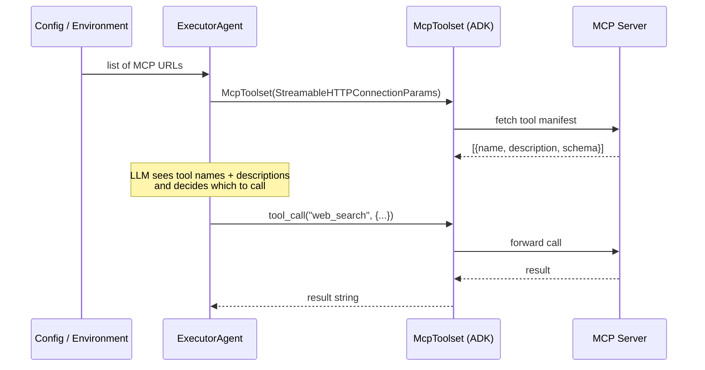
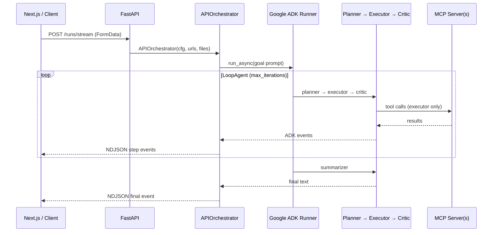
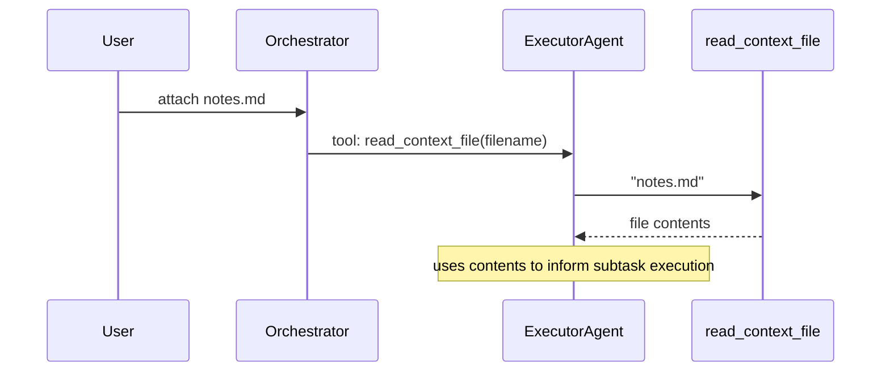

# Multi-Agent Orchestrator — Documentation

Design reference for the orchestrator. For how to run locally, see [README.md](./README.md).

---

## Problem

Most LLM applications run a single prompt-response cycle. Complex goals — research, multi-step analysis, data gathering — need planning, execution, and verification. Doing this manually means writing loop logic, managing state, and bolting tools on.

This project uses **Google ADK** to wire four specialized agents into a self-correcting loop. ADK handles iteration, context passing, and tool injection — the orchestrator only defines agent roles and exit conditions.

---

## Orchestration loop

The pipeline is a `SequentialAgent` wrapping a `LoopAgent` and a final `SummarizerAgent`:

```
SequentialAgent("orchestrator")
  ├─ LoopAgent("planning_loop", max_iterations=N)
  │    └─ SequentialAgent("pipeline")
  │         ├─ PlannerAgent
  │         ├─ ExecutorAgent
  │         └─ CriticAgent
  └─ SummarizerAgent
```



ADK manages the full conversation history. Each agent sees everything prior agents produced in the current and previous iterations.

---

## The four agents

All agents use `LlmAgent` from Google ADK with `LiteLlm` as the model backend. The model is configurable via `AgentConfig` (defaults to `claude-sonnet-4-6`).

### PlannerAgent

Breaks a high-level goal into 2–5 numbered markdown subtasks. On subsequent iterations, receives critic feedback and revises the plan.

No tools — planning is pure reasoning.

### ExecutorAgent

Executes each subtask using available tools:

- **MCP tools** — one `McpToolset(StreamableHTTPConnectionParams)` per configured MCP URL. ADK fetches tool manifests from each server and injects them as callable functions.
- **`read_context_file`** — when files are attached, a closure-based tool lets the executor read file contents by name.

### CriticAgent

Reviews the executor's work against the original goal. Two outcomes:

| Verdict | Action |
| ------- | ------ |
| `VERDICT: APPROVED` | Calls `exit_loop` tool → sets `escalate=True` → ADK breaks the loop |
| `VERDICT: REVISE` | Returns bullet-point feedback → loop continues to next iteration |

**Why `escalate`?** ADK's `LoopAgent` checks `actions.escalate` after each sub-agent run. Setting it to `True` is the idiomatic way to break out of a loop early. The `exit_loop` tool is a thin wrapper that sets this flag.

**Why string-based verdict detection?** The critic is instructed to output `VERDICT: APPROVED` or `VERDICT: REVISE` as structured markers. The orchestrator checks for `"APPROVED" in text` to classify steps for the UI. This is a pragmatic trade-off — structured output schemas add complexity for minimal benefit when the instruction is simple and reliable.

### SummarizerAgent

Runs once after the loop exits. Reads everything the executor produced and outputs a polished, concise answer — no process narration, no subtask labels. Prefers tables and bullet lists over prose.

---

## MCP tool injection



### URL resolution

MCP server URLs are passed at runtime — via `--mcp-url` flags (CLI) or the `mcp_urls` form field (API/frontend). There is no environment variable; URLs are request-specific, not app-level config.

---

## API — streaming endpoint

Single endpoint: `POST /runs/stream`. Accepts multipart form data, returns newline-delimited JSON (NDJSON).

### Request

| Field | Type | Required | Default |
| ----- | ---- | -------- | ------- |
| `goal` | string | Yes | — |
| `max_iterations` | int | No | 2 |
| `mcp_urls` | string (comma-separated) | No | — |
| `files` | file uploads | No | — |

### Response stream

Each line is a JSON object. Two event types:

**Step event** — emitted per agent turn:

```json
{
  "type": "step",
  "iteration": 1,
  "author": "executor",
  "text": "## Results\n...",
  "toolCalls": [{"name": "web_search", "args": {"query": "..."}}],
  "mcpUrls": ["http://localhost:8001/mcp"],
  "verdict": null
}
```

**Final event** — emitted once after the summarizer:

```json
{
  "type": "final",
  "result": "| Framework | Stars | ... |",
  "iterations": 2
}
```

### Flow



---

## CLI

Entry point: `cli.py` via Click. Registered as `orchestrator` in `pyproject.toml`.

```bash
uv run orchestrator run \
  --config examples/research_goal.yaml \
  --mcp-url http://localhost:8001/mcp \
  --file notes.md
```

Uses `CLIOrchestrator` — same ADK pipeline as the API, but events render as Rich panels in the terminal instead of NDJSON. Final result is displayed as rendered markdown.

---

## Configuration

### Schema

```python
class AgentConfig(BaseModel):
    model: str = "claude-sonnet-4-6"

class OrchestratorConfig(BaseModel):
    goal: str
    max_iterations: int = 2   # 1–20
    agent: AgentConfig = AgentConfig()
```

`AgentConfig` is applied to all four agents uniformly. The model string is passed to `LiteLlm()`, which routes to the appropriate provider (Anthropic, Google, OpenAI, etc.).

### YAML format

```yaml
orchestrator:
  goal: "Research the top 5 open-source LLM frameworks."
  max_iterations: 3
  agent:
    model: "claude-sonnet-4-6"
```

`agent` block is optional — omit it to use defaults. The YAML is loaded by `ConfigLoader` and validated by Pydantic.

### Environment

| Variable | Description |
| -------- | ----------- |
| `ANTHROPIC_API_KEY` | Required for Claude models via LiteLLM |
| `GEMINI_API_KEY` | Required for Gemini models |
| `CORS_ORIGINS` | Comma-separated allowed origins (default `http://localhost:3000`) |

---

## Context files

Files attached via CLI (`--file`) or API upload become `ContextFile` objects — frozen dataclasses with `name` and `content`. The executor receives a `read_context_file` tool built as a closure over the file list:



The prompt includes available filenames so the LLM knows what to request.

---

## Design decisions

### Why Google ADK?

ADK provides `LoopAgent`, `SequentialAgent`, and `McpToolset` out of the box. The orchestration logic is declarative — define agent order and exit conditions, ADK handles iteration, context threading, and tool manifest fetching. No manual loop code.

### Why LiteLLM?

ADK's `LiteLlm` adapter routes model calls through LiteLLM, which supports Anthropic, Google, OpenAI, and others behind a single interface. Switching models means changing one string in the config.

### Why NDJSON streaming?

SSE adds complexity (event types, reconnection). NDJSON is simpler — one JSON object per line, native `fetch` + `ReadableStream` on the client, `StreamingResponse` on the server. Each line is self-contained and parseable.

### Why a Summarizer agent?

The executor's output includes tool call artifacts, XML tags, and verbose per-subtask reports. The summarizer distills this into a clean, user-facing answer. It runs once after the loop — not per iteration.

### Why `escalate` for loop exit?

ADK's `LoopAgent` checks `actions.escalate` after each sub-agent. The critic's `exit_loop` tool sets this flag. This is ADK's intended mechanism for early loop termination — no custom callbacks or state management needed.

---

*Docs v1.0 — reflects current implementation.*
