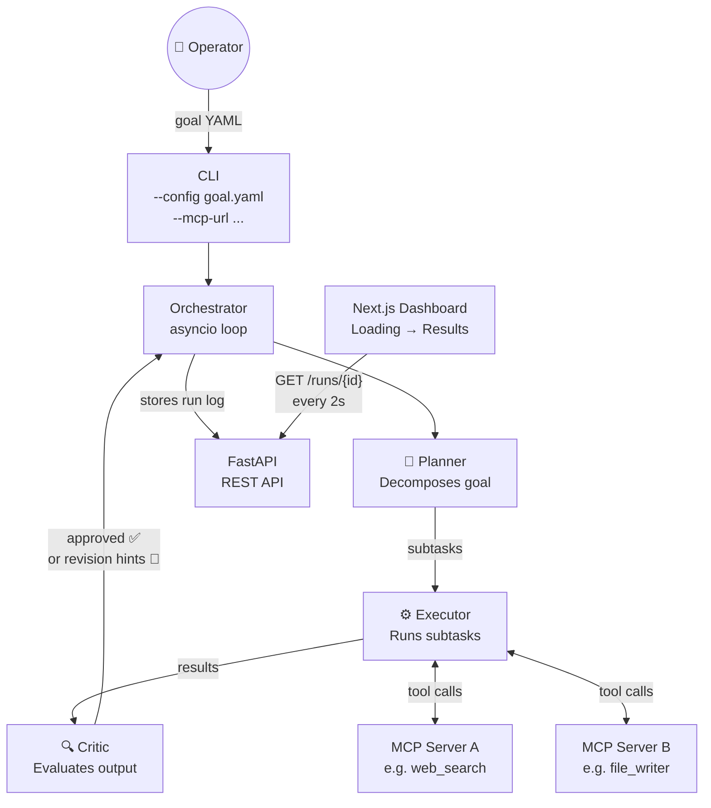
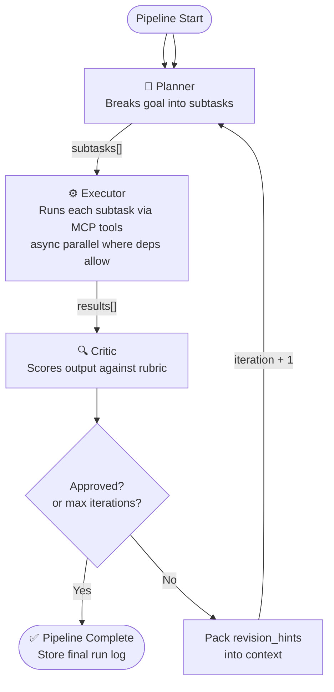
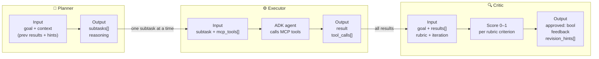
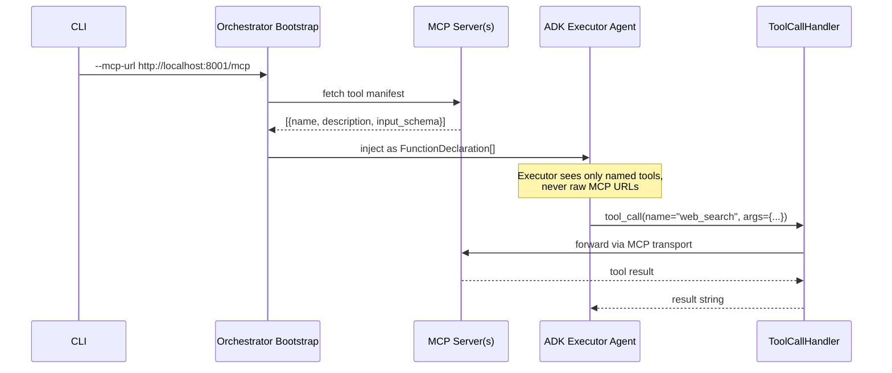
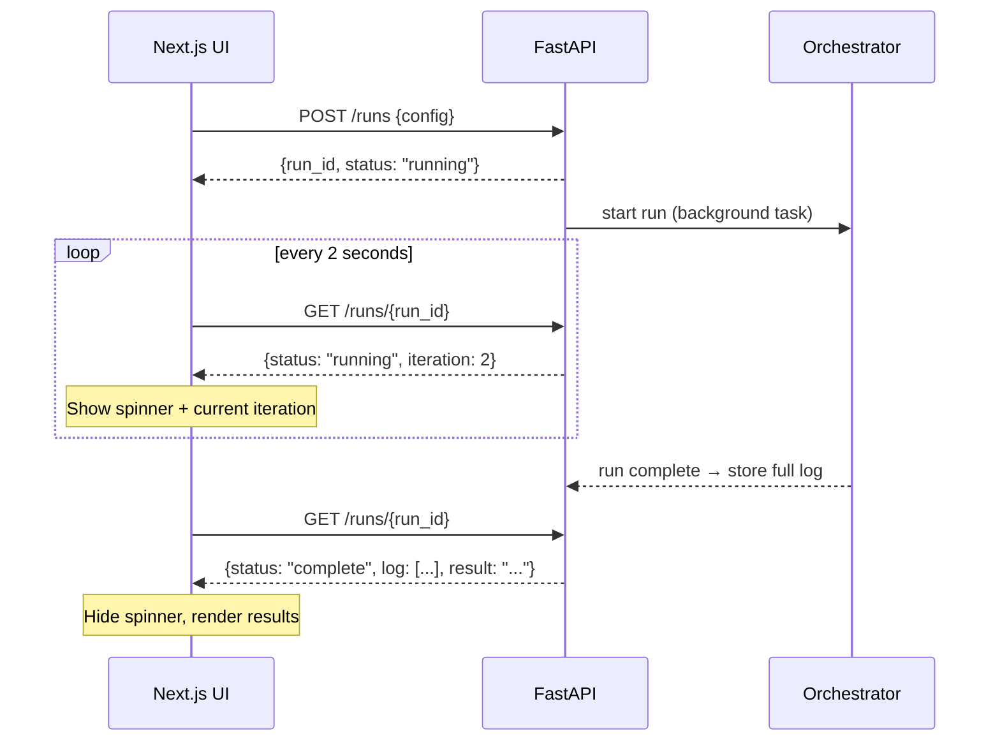
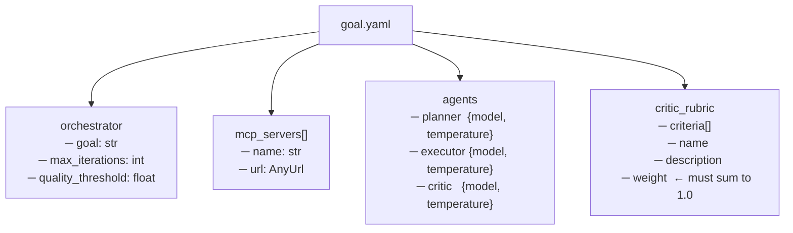
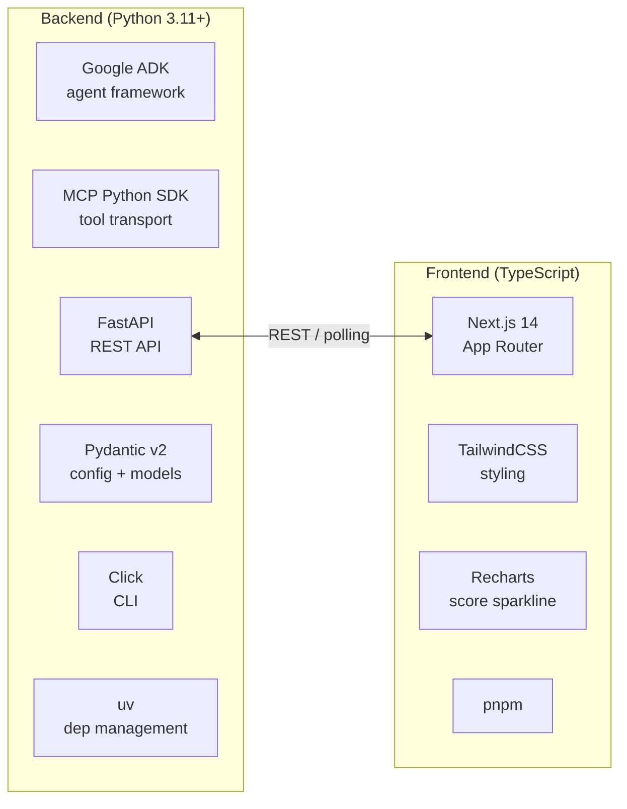
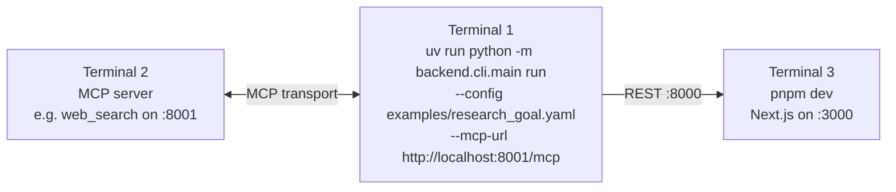

# Multi-Agent Orchestrator — Architecture Plan

> A reusable multi-agent system built on Google ADK and MCP tool use, with a simple polling-based UI.

---

## 1. System Overview



---

## 2. Orchestration Loop



> Partial revision: the Critic can target individual failing subtasks, so the Planner only re-plans the minimum necessary set on each retry.

---

## 3. The Three Core Agents



---

## 4. MCP Tool Injection



---

## 5. API & Polling (replaces streaming)



### API Endpoints

| Method | Path | Description |
|---|---|---|
| `POST` | `/runs` | Start a new run, returns `run_id` |
| `GET` | `/runs/{run_id}` | Poll status + current iteration |
| `GET` | `/runs/{run_id}/result` | Full run log + final result (once complete) |

### Run Status Model

```
RunStatus
├── run_id      UUID
├── status      "running" | "complete" | "error"
├── iteration   int  (current iteration number)
├── started_at  datetime
└── completed_at datetime | None

RunResult (returned when complete)
├── ...RunStatus fields
├── final_result   str
├── total_iterations int
├── critic_scores  list[float]   ← one per iteration
└── log            list[LogEntry]
    ├── iteration  int
    ├── subtasks   list[SubtaskResult]
    └── critic     CriticOutput
```

---

## 6. YAML Configuration Schema



---

## 7. Frontend Dashboard Layout

```
┌─────────────────────────────────────────────────────────────────┐
│  Multi-Agent Orchestrator          Run: abc-123                 │
│  Goal: "Research top 5 LLM frameworks..."                       │
├─────────────────────────────────────────────────────────────────┤
│                                                                 │
│               ⏳ Running...   Iteration 2 / 5                   │
│                                                                 │
│         🧠 Planner → ⚙️ Executor → 🔍 Critic  🔄              │
│                                                                 │
├─────────────────────────────────────────────────────────────────┤
│  (empty while running — results appear here when complete)      │
└─────────────────────────────────────────────────────────────────┘

                         ↓  on complete

┌─────────────────────────────────────────────────────────────────┐
│  Multi-Agent Orchestrator          Run: abc-123   ✅ Approved   │
│  Goal: "Research top 5 LLM frameworks..."                       │
├─────────────────────────────────────────────────────────────────┤
│  Critic Score per Iteration   ▁▃▅▇█                            │
│  Completed in 3 iterations                                      │
├─────────────────────────────────────────────────────────────────┤
│  FINAL RESULT                                                   │
│  ─────────────────────────────────────────────────────────────  │
│  | Framework   | Stars | License | ... |                        │
│  | LangChain   | 90k   | MIT     | ... |                        │
│  | ...                                                          │
├─────────────────────────────────────────────────────────────────┤
│  RUN LOG  (collapsible per iteration)                           │
│  ▶ Iteration 1 — Score 0.62 — 4 subtasks                       │
│  ▶ Iteration 2 — Score 0.79 — 3 subtasks                       │
│  ▼ Iteration 3 — Score 0.91 — 2 subtasks  ✅                   │
│    Subtask 1: web_search → "..."                                │
│    Subtask 2: file_writer → saved comparison.md                 │
└─────────────────────────────────────────────────────────────────┘
```

---

## 8. Folder Structure

```
multi-agent-orchestrator/
│
├── Plan.md
├── README.md
├── pyproject.toml                   ← uv / Python project
├── uv.lock
│
├── backend/
│   ├── agents/
│   │   ├── planner.py              ← PlannerAgent
│   │   ├── executor.py             ← ExecutorAgent
│   │   └── critic.py               ← CriticAgent
│   │
│   ├── orchestrator/
│   │   ├── loop.py                 ← async orchestration loop
│   │   ├── context.py              ← RunContext (shared state + log)
│   │   └── runner.py               ← top-level entrypoint
│   │
│   ├── mcp/
│   │   ├── client.py               ← connects to MCP servers
│   │   └── handler.py              ← ADK ToolCallHandler → MCP
│   │
│   ├── api/
│   │   ├── app.py                  ← FastAPI factory
│   │   ├── store.py                ← in-memory run store (dict of RunStatus)
│   │   └── routes/
│   │       └── runs.py             ← POST /runs, GET /runs/{id}, GET /runs/{id}/result
│   │
│   ├── config/
│   │   ├── schema.py               ← Pydantic Config + RunStatus models
│   │   └── loader.py               ← YAML → Config
│   │
│   ├── cli/
│   │   └── main.py                 ← Click CLI entry point
│   │
│   └── examples/
│       └── research_goal.yaml
│
├── frontend/
│   ├── package.json
│   ├── tsconfig.json
│   ├── tailwind.config.ts
│   └── src/
│       ├── app/
│       │   ├── layout.tsx
│       │   ├── page.tsx            ← start a new run
│       │   └── run/[runId]/
│       │       └── page.tsx        ← dashboard (loading → results)
│       │
│       ├── components/
│       │   ├── RunningSpinner.tsx  ← spinner + iteration counter
│       │   ├── ResultView.tsx      ← final result display
│       │   ├── RunLog.tsx          ← collapsible iteration log
│       │   └── CriticScoreChart.tsx ← Recharts sparkline
│       │
│       ├── hooks/
│       │   └── useRunPoller.ts     ← polls GET /runs/{id} every 2s
│       │
│       └── types/
│           └── runs.ts             ← TypeScript mirror of RunStatus / RunResult
│
└── docker/
    ├── Dockerfile.backend
    ├── Dockerfile.frontend
    └── docker-compose.yml
```

---

## 9. Tech Stack



> Streaming removed: no WebSocket, no SSE, no Zustand, no event queue. Just `fetch` + a `useRunPoller` hook.

---

## 10. Build & Run — Local Dev



### Implementation Order

```mermaid
graph LR
    subgraph Phase1 ["Phase 1 — Backend"]
        direction TB
        C1["1. config/"] --> C2["2. mcp/"]
        C2 --> C3["3. agents/planner"]
        C3 --> C4["4. agents/executor"]
        C4 --> C5["5. agents/critic"]
        C5 --> C6["6. orchestrator/loop"]
        C6 --> C7["7. api/"]
        C7 --> C8["8. cli/"]
    end

    subgraph Phase2 ["Phase 2 — Frontend"]
        direction TB
        F1["1. types/runs.ts"] --> F2["2. hooks/useRunPoller"]
        F2 --> F3["3. RunningSpinner"]
        F3 --> F4["4. ResultView + RunLog"]
        F4 --> F5["5. CriticScoreChart"]
        F5 --> F6["6. Dashboard page"]
    end

    C8 --> F1
```



---

*Plan v1.2 — streaming replaced with polling.*
