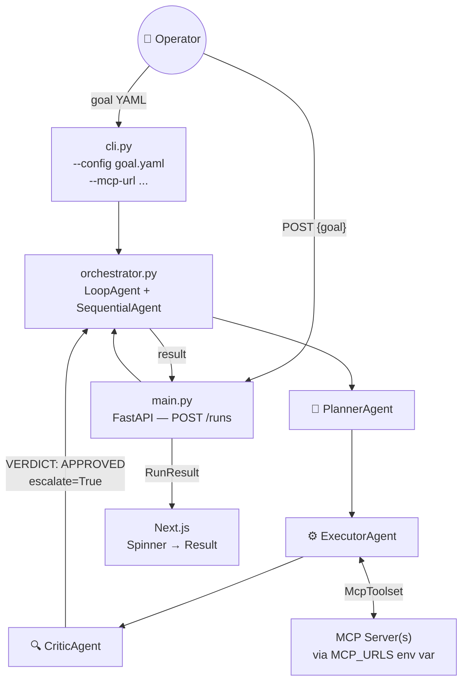
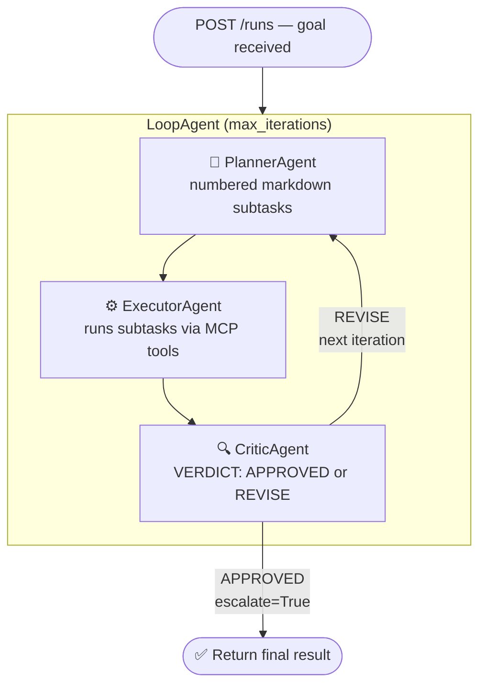
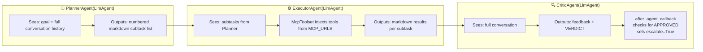
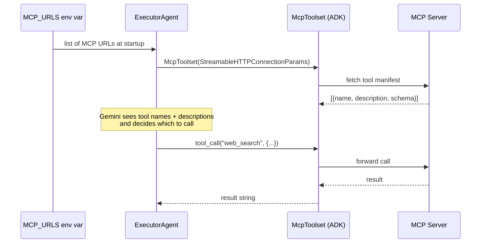
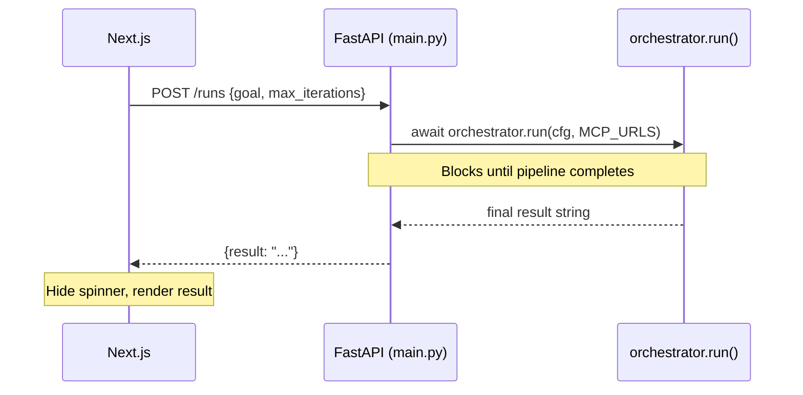
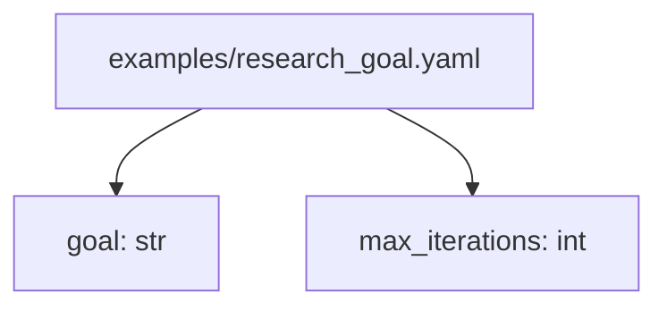
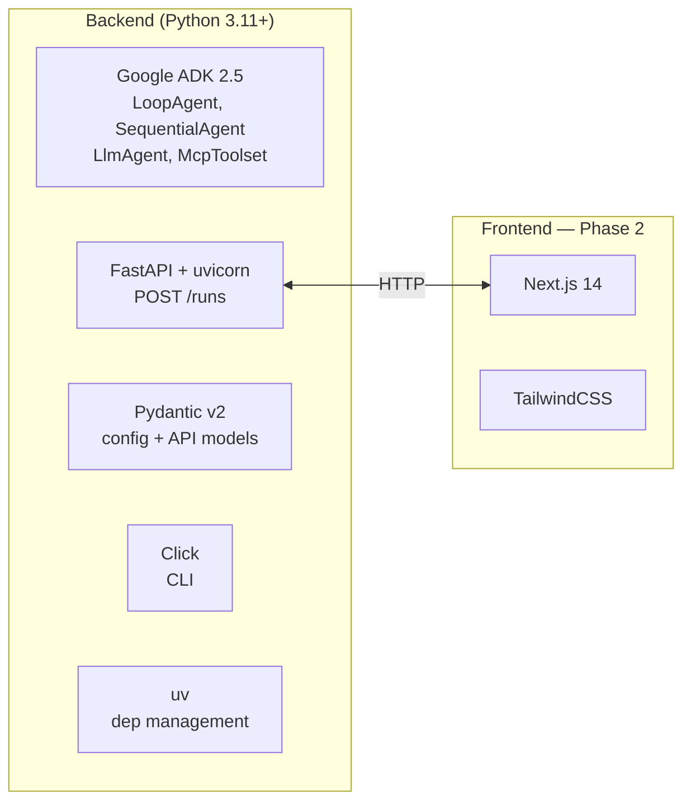
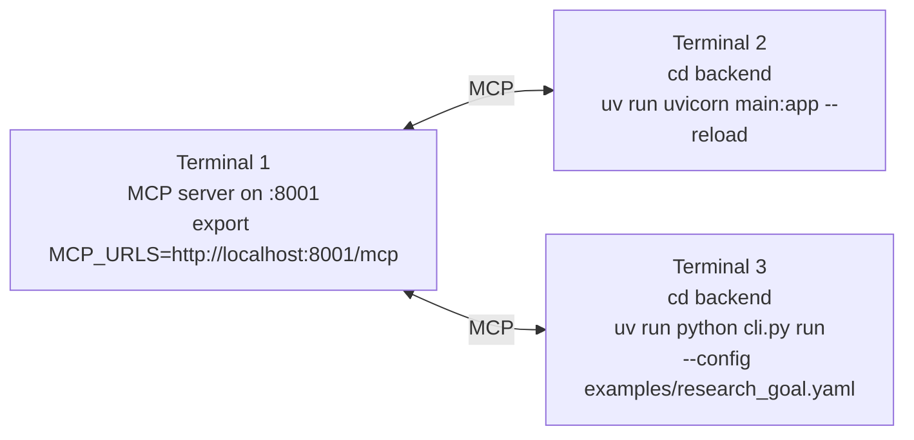

# Multi-Agent Orchestrator — Architecture Plan

> A reusable multi-agent system built on Google ADK and MCP tool use, with a simple loading UI.

---

## 1. System Overview



---

## 2. Orchestration Loop (ADK-native)



> ADK handles iteration and context passing automatically — no manual loop code.

---

## 3. The Three Agents



---

## 4. MCP Tool Injection



---

## 5. API — Single Endpoint



### Models

```
RunRequest   → goal: str, max_iterations: int
RunResult    → result: str
```

---

## 6. YAML Config



> Minimal on purpose — MCP URLs come from the `MCP_URLS` env var, not the config file.

---

## 7. Frontend Layout

```
┌──────────────────────────────────────────┐
│  Multi-Agent Orchestrator                │
│  Goal: "Research top 5 LLM frameworks"   │
├──────────────────────────────────────────┤
│                                          │
│    ⏳ Running...                         │
│    🧠 → ⚙️ → 🔍  (animated)             │
│                                          │
└──────────────────────────────────────────┘

              ↓  when POST /runs returns

┌──────────────────────────────────────────┐
│  ✅ Complete                             │
├──────────────────────────────────────────┤
│  RESULT                                  │
│  ──────────────────────────────────────  │
│  | Framework  | Stars | License | ...  │ │
│  | LangChain  | 90k   | MIT     | ...  │ │
└──────────────────────────────────────────┘
```

---

## 8. Actual Folder Structure

```
multi-agent-orchestrator/
│
├── Plan.md
├── README.md
├── .gitignore
│
└── backend/
    ├── pyproject.toml              ← uv project + dependencies
    ├── uv.lock
    ├── .venv/
    │
    ├── main.py                     ← FastAPI, POST /runs
    ├── orchestrator.py             ← functional pipeline (LoopAgent)
    ├── cli.py                      ← Click CLI entry point
    │
    ├── agents/
    │   ├── planner.py              ← PlannerAgent(LlmAgent)
    │   ├── executor.py             ← ExecutorAgent(LlmAgent) + McpToolset
    │   └── critic.py               ← CriticAgent(LlmAgent) + escalate callback
    │
    ├── config/
    │   ├── schema.py               ← OrchestratorConfig, AgentConfig
    │   └── loader.py               ← ConfigLoader class
    │
    ├── mcp/
    │   └── client.py               ← MCPClient (direct use / testing)
    │
    └── examples/
        └── research_goal.yaml
```

> Frontend not built yet — coming in Phase 2.

---

## 9. Tech Stack



---

## 10. Local Dev



---

*Plan v1.3 — reflects actual implementation.*
